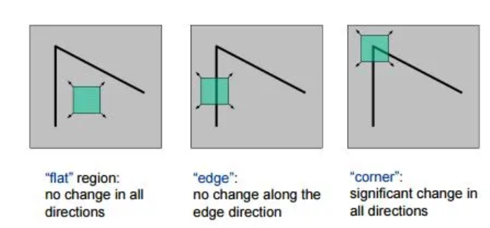
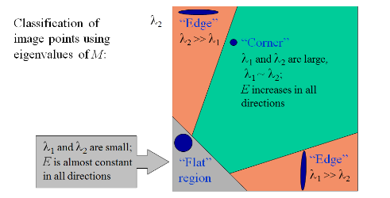
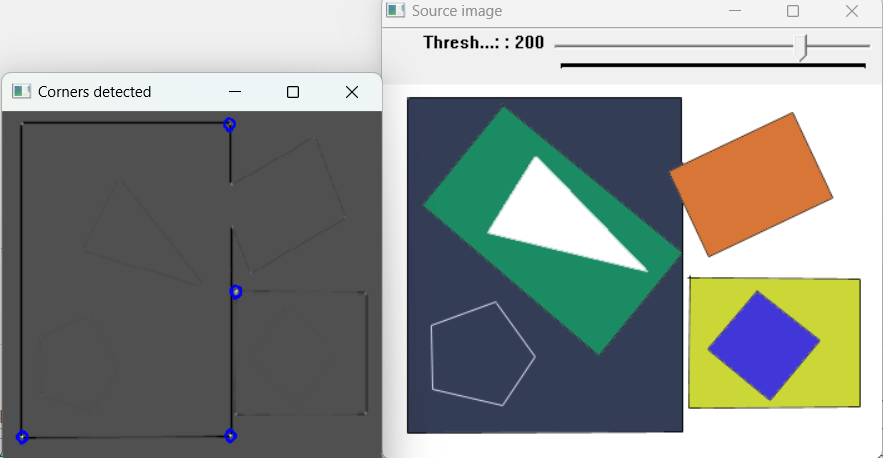
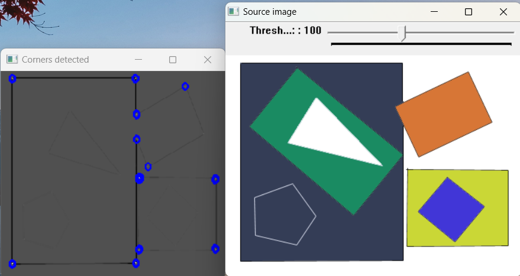
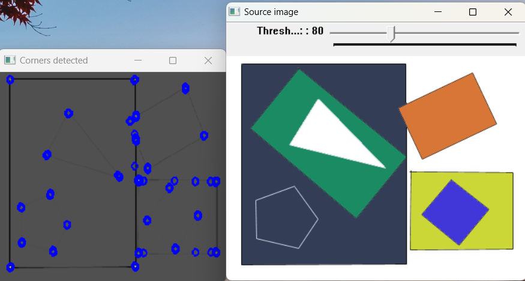
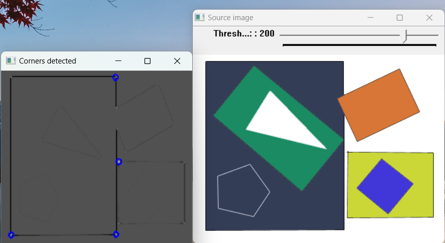
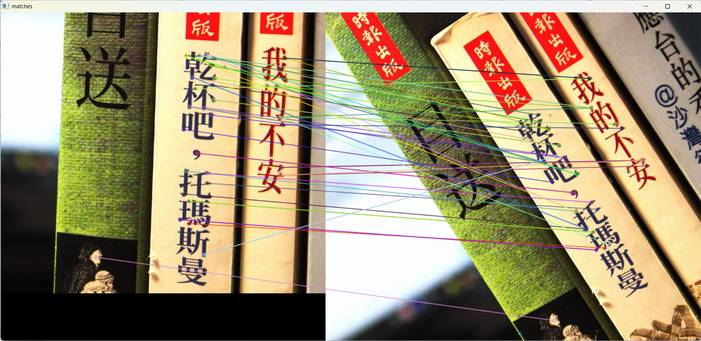
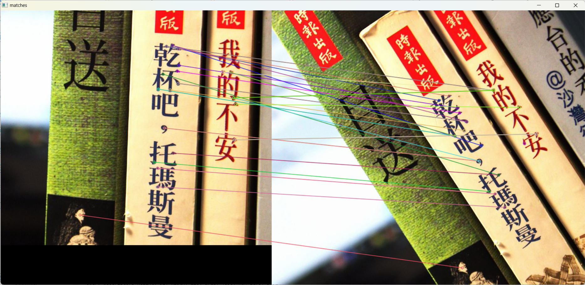
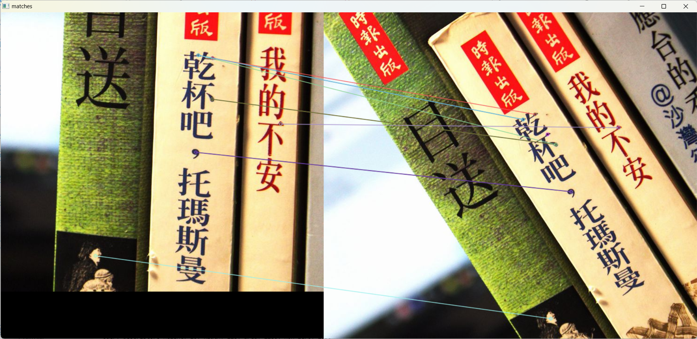

# Features detection

## 实验原理

在一幅图像中，角点具有以下特征：



根据以上观察，对于给定图像和固定尺寸的邻域窗口，计算窗口平移前后窗口内像素的变化情况，可以用自相关函数度量：

$$
E(u,v) = \sum_{x}\sum_{y} w(x,y) [I(x+u,y+v) - I(x,y)]^2
$$

窗口加权函数可以是均值函数或高斯函数。

根据泰勒展开，可得到近似

$$
I(x+u,y+v) \approx I(x,y) + I_x(x,y)u + I_y(x,y)v
$$

因此

$$
E(u,v) \approx \sum_{x,y} w(x,y) [I_x(x,y)u + I_y(x,y)v]^2 = [u, v] M(x, y) [u, v]^\top
$$

$$
M(x, y) = \sum_{w} \begin{bmatrix} I_x^2 & I_x  I_y \\ I_x  I_y & I_y^2 \end{bmatrix} = \begin{bmatrix} A & C \\ C & B \end{bmatrix}
$$

考虑角点的边界和坐标轴对齐的情况，如下图所示，在平移窗口内，只有上侧和左侧边缘，上边缘\(I_y\) 很大而 \(I_x\) 很小，左边缘 \(I_x\) 很大而 \(I_y\) 很小，所以矩阵 \(M\) 可化简为

$$
M = \begin{bmatrix} \lambda_1 & 0 \\ 0 & \lambda_2 \end{bmatrix}
$$

当角点边界和坐标轴没有对齐时，可对角点进行旋转变换，将其变换到与坐标轴对齐，这种旋转操作可用矩阵的相似对角化来表示，即

$$
M = XΣ\ X^T = X\begin{bmatrix} \lambda_{1} & 0 \\ 0 & \lambda_2 \end{bmatrix}X^T
$$

其中，

$$
Mx_i = \lambda_i x_i
$$

所以我们可以根据M的特征值判断该点是否为角点



在判断角点时，无需具体计算矩阵 $M$ 的特征值，而使用下式近似计算角点响应值：

$$
R = \text{det}(M) - \alpha \cdot (\text{trace}(M))^2
$$

其中，

$$
\text{det}(M) = \lambda_1 \lambda_2 = AB - C^2
$$

$$
\text{trace}(M) = \lambda_1 + \lambda_2 = A + B
$$

式中，$\text{det}(M)$ 为矩阵 $M$ 的行列式，$\text{trace}(M)$ 为矩阵 $M$ 的迹，$\alpha$ 为一常数，通常取值为 $0.04\sim0.06$。

## 实验步骤

### Harris 角点检测

* 调用opencv的cornerHarris函数

```cpp
void cv::cornerHarris(InputArray src,
OutputArray dst,
int blockSize,
int ksize,
double k,
int borderType = BORDER_DEFAULT 
)
```

参数

* `src`: 单通道uint8或float图像
* `dst`: 角点检测输出，类型为CV_32FC1,大小与输入图像相同
* `blockSize`: 邻域大小
* `ksize`: Soble算子孔径参数
* `k`: 常数
* `borderType`: 像素外推方法

实现

```cpp
#include "opencv2/highgui/highgui.hpp"
#include "opencv2/imgproc/imgproc.hpp"
#include <iostream>
#include <stdio.h>
#include <stdlib.h>

using namespace cv;
using namespace std;

/// Global variables
Mat src, src_gray;
int thresh = 200;
int max_thresh = 255;

const char* source_window = "Source image";
const char* corners_window = "Corners detected";
const char* dst_window = "dst image";
/// Function header
void cornerHarris_demo (int, void*);
/** @function main */
int main (int argc, char** argv) {
    /// Load source image and convert it to gray
    // src = imread ("house.jpg", 1);
	src = imread("pic5.png", 1);
    cvtColor (src, src_gray, COLOR_BGR2GRAY);

    /// Create a window and a trackbar
    namedWindow (source_window, WINDOW_AUTOSIZE);
    createTrackbar ("Threshold: ", source_window, &thresh, max_thresh, cornerHarris_demo);
    imshow (source_window, src);

    cornerHarris_demo (0, 0);

    waitKey (0);
    return (0);
}

/** @function cornerHarris_demo */
void cornerHarris_demo (int, void*) {

    Mat dst, dst_norm, dst_norm_scaled;
    dst = Mat::zeros (src.size(), CV_32FC1);

    /// Detector parameters
    int blockSize = 2;
    int apertureSize = 3;
    double k = 0.04;

    /// Detecting corners
    cornerHarris (src_gray, dst, blockSize, apertureSize, k, BORDER_DEFAULT);
    /// Normalizing
    normalize (dst, dst_norm, 0, 255, NORM_MINMAX, CV_32FC1, Mat() );
    //convertScaleAbs (dst_norm, dst_norm_scaled);
	dst_norm_scaled.create(dst.rows, dst.cols, CV_8UC3);
	Mat_<Vec3b> m = dst_norm_scaled;


	for (int j = 0; j < dst_norm.rows; j++) {
		for (int i = 0; i < dst_norm.cols; i++) {
			uchar v = dst_norm.at<float>(j, i);
			m(j, i) = Vec3b(v, v, v);
		}
	}

    /// Drawing a circle around corners
    for (int j = 0; j < dst_norm.rows; j++) {
        for (int i = 0; i < dst_norm.cols; i++) {
            if ((int)dst_norm.at<float>(j, i) > thresh) {
                circle(dst_norm_scaled, Point(i, j), 5, Scalar(255, 0, 0), 2, 8, 0);
            }
        }
    }
    /// Showing the result
    namedWindow(corners_window, WINDOW_NORMAL);
    imshow(corners_window, dst_norm_scaled);
}
```







* 自定义connorHarris

  ```cpp
  void my_cornerHarris(const Mat& src, Mat& dst, int blockSize, int apertureSize, double k, int borderType) {
      // Convert the source image to grayscale
      if (src.channels() > 1) {
          cvtColor(src, src, COLOR_BGR2GRAY);
      }

      // Calculate the derivatives using Sobel operator
      Mat dx, dy;
      Sobel(src, dx, CV_32F, 1, 0, apertureSize, 1, 0, borderType);
      Sobel(src, dy, CV_32F, 0, 1, apertureSize, 1, 0, borderType);

      // Calculate the products of derivatives at each pixel
      Mat dx2 = dx.mul(dx);
      Mat dy2 = dy.mul(dy);
      Mat dxy = dx.mul(dy);

      // Apply Gaussian filter to the products of derivatives
      // GaussianBlur(dx2, dx2, Size(blockSize, blockSize), 0, 0, borderType);
      // GaussianBlur(dy2, dy2, Size(blockSize, blockSize), 0, 0, borderType);
      // GaussianBlur(dxy, dxy, Size(blockSize, blockSize), 0, 0, borderType);
      //Apply mean filter to the products of derivatives
      blur(dx2, dx2, Size(blockSize, blockSize), Point(-1, -1), borderType);
      blur(dy2, dy2, Size(blockSize, blockSize), Point(-1, -1), borderType);
      blur(dxy, dxy, Size(blockSize, blockSize), Point(-1, -1), borderType);

      // Calculate the Harris response
      Mat det = dx2.mul(dy2) - dxy.mul(dxy);
      Mat trace = dx2 + dy2;
      dst = det - k * trace.mul(trace);

      // Normalize the response
      normalize(dst, dst, 0, 255, NORM_MINMAX, CV_32F);

      // Convert the response to 8-bit image
      dst.convertTo(dst, CV_8U);
  }
  ```

  
* 
* 

### SIFT角点检测

```cpp


#include <stdio.h>
#include <iostream>
#include "opencv2/core/core.hpp"
#include "opencv2/features2d/features2d.hpp"
#include "opencv2/highgui/highgui.hpp"
// #include <opencv2/xfeatures2d/nonfree.hpp>
// #include <opencv2/xfeatures2d.hpp>
#include <vector>

using namespace std;
using namespace cv;

int main(int argc, char** argv)
{
	// Load the two images.
	// 'query' and 'train' are the notation used by the parameters in the 'match' function.
	// It seems backwards from how I'm applying it--the first image is where I've
	// isolated the object I'm looking for, and the second is the image I want to locate that
	// object in.
	Mat queryImg = imread("D:\\OneDrive - mails.tsinghua.edu.cn\\Learn\\Digital Image Process\\Experiments\\Experiment-5\\l2.jpg");

	Mat trainImg = imread("D:\\OneDrive - mails.tsinghua.edu.cn\\Learn\\Digital Image Process\\Experiments\\Experiment-5\\r2.jpg");

	// Verify the images loaded successfully.
	if (queryImg.empty() || trainImg.empty())
	{
		printf("Can't read one of the images\n");
		return -1;
	}

	// Detect keypoints in both images.
	Ptr<SIFT> detector = SIFT::create(50);
	vector<KeyPoint> queryKeypoints, trainKeypoints;
	detector->detect(queryImg, queryKeypoints);
	detector->detect(trainImg, trainKeypoints);


	// Print how many keypoints were found in each image.
	printf("Found %d and %d keypoints.\n", queryKeypoints.size(), trainKeypoints.size());

	// Compute the SIFT feature descriptors for the keypoints.
	// Multiple features can be extracted from a single keypoint, so the result is a
	// matrix where row 'i' is the list of features for keypoint 'i'.
	Ptr<SiftDescriptorExtractor> extractor = SiftDescriptorExtractor::create();
	Mat queryDescriptors, trainDescriptors;
	extractor->compute(queryImg, queryKeypoints, queryDescriptors);
	extractor->compute(trainImg, trainKeypoints, trainDescriptors);


	// Print some statistics on the matrices returned.
	Size size = queryDescriptors.size();
	printf("Query descriptors height: %d, width: %d, area: %d, non-zero: %d\n",
		size.height, size.width, size.area(), countNonZero(queryDescriptors));

	size = trainDescriptors.size();
	printf("Train descriptors height: %d, width: %d, area: %d, non-zero: %d\n",
		size.height, size.width, size.area(), countNonZero(trainDescriptors));

	// For each of the descriptors in 'queryDescriptors', find the closest 
	// matching descriptor in 'trainDescriptors' (performs an exhaustive search).
	// This seems to only return as many matches as there are keypoints. For each
	// keypoint in 'query', it must return the descriptor which most closesly matches a
	// a descriptor in 'train'?
	BFMatcher matcher(NORM_L2);
	vector<DMatch> matches;
	matcher.match(queryDescriptors, trainDescriptors, matches);

	// Print the number of matches.

	printf("Found %d matches.\n", matches.size());

	// Draw the results. Displays the images side by side, with colored circles at
	// each keypoint, and lines connecting the matching keypoints between the two 
	// images.
	namedWindow("matches", 1);
	Mat img_matches;
	drawMatches(queryImg, queryKeypoints, trainImg, trainKeypoints, matches, img_matches);
	imshow("matches", img_matches);
	waitKey(0);

	return 0;
}
```

k = 50



k = 30



k = 10


